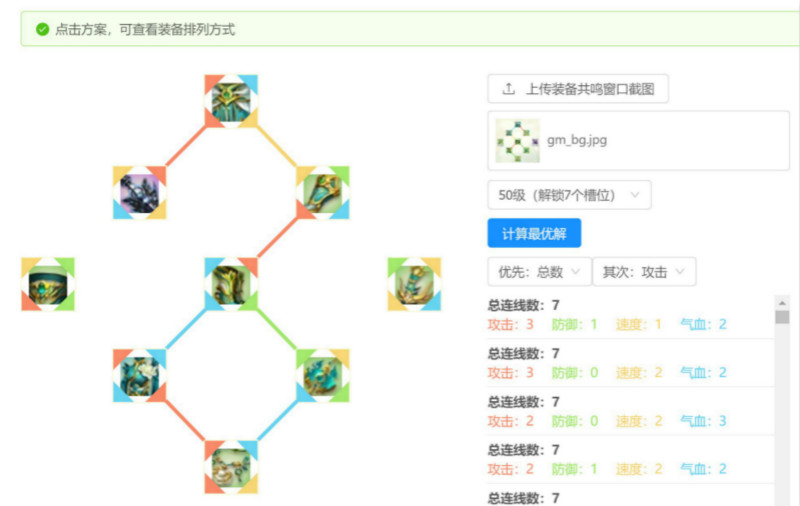

# 灵山奇缘-装备模拟器

http://www.homkai.com/lsqy-gm/

- 上传装备共鸣页面截图，opencv识别出装备及四角颜色
- 求最优解，支持自定义偏好排序

## 示意图
上传装备共鸣截图

识别出截图装备及四角颜色-计算出最佳排列方案

## 代码目录
- docs 网站前端托管
- fe 前端部分
- be 后端部分

# 贴吧交流
- 装备共鸣模拟器有知道哪有么？没有的话，如果有需求我可以开发 http://tieba.baidu.com/p/5768717398
- 装备共鸣模拟器，开发好了，支持上传截图自动识别属性 http://tieba.baidu.com/p/5764520721

欢迎大家一起来完善